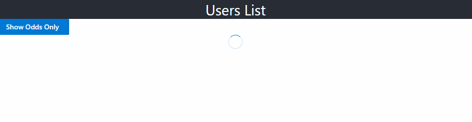

# Getting Started

This assignment uses the following packages: 

- [FluentUI](https://developer.microsoft.com/en-us/fluentui#/controls/web)

## Available Scripts

In the project directory, you can run:

### `npm ci`
Installs the necessary dependencies to run the application.

### `npm start`

Runs the app in the development mode.\
Open [http://localhost:3000](http://localhost:3000) to view it in the browser.

The page will reload if you make edits.\
You will also see any lint errors in the console.

## Your task
- [ ] Add a FluentUI [DetailsList](https://developer.microsoft.com/en-us/fluentui#/controls/web/detailslist) component to display a list of users from [this JSON array](https://jsonplaceholder.typicode.com/users)
  - The code to retrieve this data from the URL above is provided to you in the file *src/api/fetchData.ts*
  - Display the following properties in the DataList:
    - [ ] Id
    - [ ] Name
    - [ ] Username
    - [ ] Email
      - [The email address should be clickable and open up the user's default email client of choice.](https://www.w3docs.com/snippets/html/how-to-create-mailto-links.html)
    - [ ] Address
      - This information should be displayed in this format: 
        - > {Street} 
          > {Suite} 
          > {City} {Zipcode}
    - [ ] Company
      - The company information should be hidden behind a [DefaultButton](https://developer.microsoft.com/en-us/fluentui#/controls/web/button) component with the text "Show Info". After this button is clicked the information should be displayed in this format: 
        - > **Name:** {Company Name} 
          > **Catch Phrase:** {Company Catchphrase} 
          > **Bs:** {Company Bs}
  - While this the data is being loaded, display a [Spinner](https://developer.microsoft.com/en-us/fluentui#/controls/web/spinner) component
    - 
- [ ] Add a FluentUI [PrimaryButton](https://developer.microsoft.com/en-us/fluentui#/controls/web/button) with the text **Show Odds Only** to give the user the option to only display the elements in the array with odd-numbered Ids. Once clicked, this button's text should change to **Show All** and if it is clicked again it will display all of the records again. After this, the text and click behavior should go back to what it was originally.
  - This behavior should not affect how the **Show Info** company info button behavior works.
    - If a record is displaying its company information and is hidden temporarily because of the **Show Odds Only** button, it should still be displaying its company info after it is displayed again.
    - If a record is NOT displaying its company information and is hidden temporarily because of the **Show Odds Only** button, it should NOT be displaying its company info after it is displayed again.

# Expected Results
Please review the video below to see how the application should look and behave.

<video width="640" height="360" controls>
  <source src="./expected.webm" type="video/webm">
  Your browser does not support the video tag.
</video>

